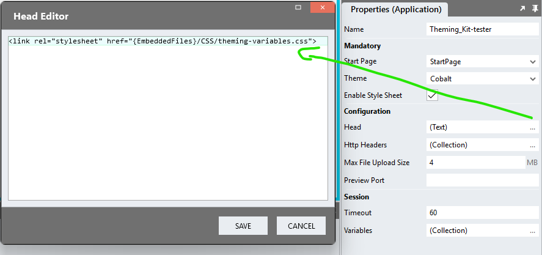

# Stadium Theming-Kit
Create or adjust Stadium themes without writing any CSS

## Description
This kit supports changing a variety of application styles for Stadium version 6.12 or higher.

For applications created in Designers pre 6.12, please use [this version](/pre6.12)

## Version
2.0 - Use version 2+ of this kit for applications created in Stadium 6.12+

## Customizing a Theme
To customise a theme using this kit
1. Open the *theming-variables.css* file in an editor of your choice
2. Uncomment variables in the *theming-variables.css* file you want to customise
3. Amend the related values as you see fit
4. **Do not** move variables around in the file
5. **Do not** add or remove variables
6. **Do not** change variable names

## Setup
1. Create a folder called "CSS" in your "EmbeddedFiles" folder
2. Drag the customised *theming-variables.css* file to the "CSS" folder in the *EmbeddedFiles* in your application
3. Paste the link tag below into the *Head* property of your application properties
```html
<link rel="stylesheet" href="{EmbeddedFiles}/CSS/theming-variables.css">
``` 



7. Preview your applications to see the effect of changes you made
8. Change more variables and *Overwrite* the *theming-variables.css* file in the "CSS" folder

### CSS Upgrading
To upgrade the CSS in this module, follow the [steps outlined in this repo](https://github.com/stadium-software/samples-upgrading)

## Working with Stadium Repos
Stadium Repos are not static. They change as additional features are added and bugs are fixed. Using the right method to work with Stadium Repos allows for upgrading them in a controlled manner. How to use and update application repos is described here 

[Working with Stadium Repos](https://github.com/stadium-software/samples-upgrading)